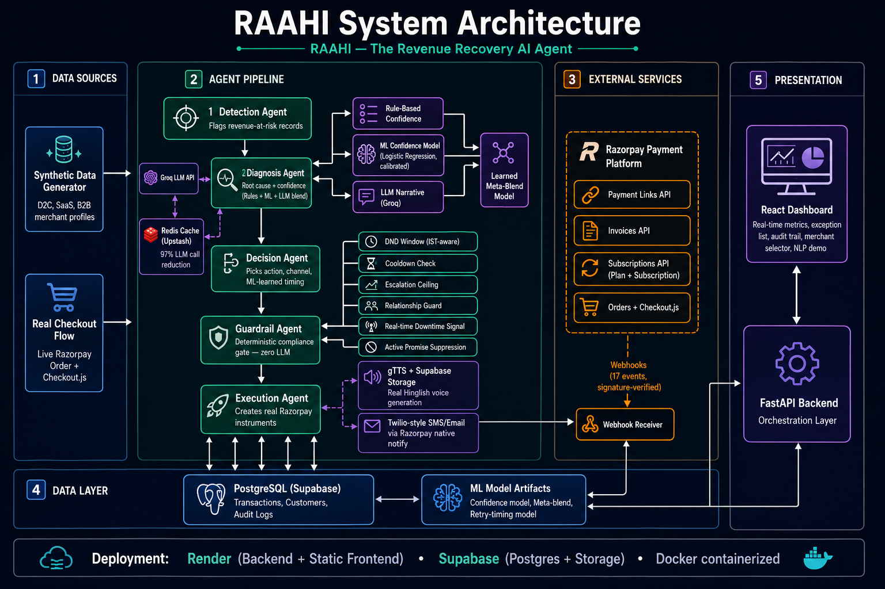

<div align="center">

# RAAHI — The Revenue Recovery AI Agent

*Detects revenue at risk, diagnoses why, decides the right intervention, and recovers it — every action explainable, bounded, and audited.*




<!-- PLACEHOLDER: demo video link -->
#**🎥 Demo Video:** [https://youtu.be/GK2PP6yvHpY]

<!-- PLACEHOLDER: live demo link -->
#**🚀 Live Demo:** [https://raahi-frontend-y2zx.onrender.com/] · 


</div>

---

## Table of Contents

- [The Problem](#the-problem)
- [What RAAHI Actually Does](#what-raahi-actually-does)
- [Architecture](#architecture)
- [The Five Agents](#the-five-agents)
- [What's Genuinely Real vs. What's Modeled](#whats-genuinely-real-vs-whats-modeled)
- [Machine Learning Components](#machine-learning-components)
- [Testing & Validation Evidence](#testing--validation-evidence)
- [Compliance & Guardrails](#compliance--guardrails)
- [RAAHI vs. Naive Baseline](#raahi-vs-naive-baseline)
- [Tech Stack](#tech-stack)
- [Setup & Reproduction](#setup--reproduction)
- [Testing](#testing)
- [Dashboard Features](#dashboard-features)
- [Known Limitations & What's Next](#known-limitations--whats-next)
- [Problems Faced While Building RAAHI, and How I Overcame Them](#problems-faced-while-building-raahi-and-how-i-overcame-them)
- [Project Structure](#project-structure)

---

## The Problem

Revenue loss rarely happens in one clean step. A payment degrades, a checkout gets abandoned, a subscription fails, or an invoice goes overdue — each needs a different diagnosis and a different response. Most businesses handle this with the same generic reminder sent to everyone, on a fixed schedule, with no way to tell whether a customer opted out, already promised to pay, or has simply exhausted every reasonable retry.

RAAHI closes this loop: **detect → diagnose → decide → gate → recover**, with every decision logged, explainable, and bounded by deterministic safety rules.

## What RAAHI Actually Does

RAAHI implements all seven example directions from the track brief, with real, working infrastructure behind each one — not mockups:

| Direction | Implementation |
|---|---|
| **Payment degradation → root cause → recovery action** | Real root-cause classification (rule-based + ML + LLM blend), real Razorpay Payment Link creation |
| **Checkout drop-off recovery** | Dedicated `checkout_abandoned` root cause with fast-response, low-friction policy |
| **Failed-subscription recovery** | Real Razorpay Plan + Subscription objects created via API |
| **B2B receivables chaser** | Real Invoice API, staged reminders scaled to days overdue |
| **Mandate retry sequencer** | Attempt-limit and cooldown enforcement on subscription recovery attempts |
| **Hinglish voice recovery** | Real LLM-generated Hinglish scripts, converted to real playable Hindi audio (gTTS), stored and served from Supabase Storage |
| **Promise-to-pay tracker** | Real NLP intent extraction (Groq LLM) on free-text customer replies — correctly extracts commitment dates from natural language, including Hinglish, and correctly rejects vague/negative replies |

## Architecture

See [`docs/Architecture Diagrams.md`](./docs/Architecture%20Diagrams.md) for the full set of diagrams — system architecture, sequence flow, use case, ER/database schema, guardrail decision flow, and deployment architecture.


## The Five Agents

1. **Detection Agent** — scans for records in `at_risk` or `recovering` status that are currently eligible (respecting `next_eligible_at`, which is set by guardrails, promises, and DND deferrals). Writes the first audit trail entry.

2. **Diagnosis Agent** — classifies root cause via a deterministic lookup table, then computes a confidence score by blending three signals: rule-based confidence, a calibrated Logistic Regression ML model, and an LLM-generated narrative confidence — combined via a **learned meta-blend model** (not hand-picked weights). Also detects systemic events (e.g., if >35% of a batch shares one root cause, flags it as a likely bank/issuer-side outage rather than isolated customer problems).

3. **Decision Agent** — maps root cause to an intervention (retry, payment link, reminder tier), applies cost-aware channel selection (never spends more on contact than the transaction is worth), applies customer-segment adjustments, and schedules the retry using an **ML-learned optimal timing model** rather than a fixed delay.

4. **Guardrail Agent** — the deterministic safety gate. **Zero LLM involvement** — pure rule checks, in strict priority order:
   - Active promise-to-pay suppression
   - Attempt-limit enforcement
   - Escalation ceiling (hard stop at 3 automated attempts, forces human review)
   - Relationship guard (high-value customers downgraded to a gentler channel on repeat contact)
   - Cooldown period
   - Real-time payment-method downtime (via Razorpay's own webhook signal, not inferred)
   - DND window (9 PM–9 AM IST)

   Every check writes a machine-readable violation code (`ATTEMPT_LIMIT_EXCEEDED`, `PROMISE_ACTIVE`, `RELATIONSHIP_GUARD`, etc.) to the audit trail.

5. **Execution Agent** — creates the real Razorpay instrument (Payment Link, Invoice, or Subscription+Plan), generates real Hinglish voice messages where the channel is `voice`, and lets Razorpay's native notification system handle real SMS/email delivery. Recovery confirmation comes entirely from the **webhook receiver**, not from polling or assumption.

## What's Genuinely Real vs. What's Modeled

This project makes a deliberate, honest distinction, tracked via an `outcome_source` field on every transaction:

- **`real_verified`** — outcome confirmed by an actual Razorpay webhook (a real payment happened)
- **`modeled`** — outcome not yet known; record is genuinely awaiting real customer action
- **`training_simulation`** — outcome synthetically labeled *only* to provide training data for ML models, using a documented, multi-factor probability model (never counted in headline recovery metrics)

We validated the entire real-payment path end-to-end: a real payment link was paid with a real Razorpay test card, the real webhook fired, signature verification passed, and the transaction correctly updated to `recovered`. We also validated genuine failure capture: a real checkout attempt was deliberately failed, and Razorpay's real `payment.failed` webhook delivered the actual decline reason (`international_transaction_not_allowed`), which RAAHI mapped correctly into its internal root-cause taxonomy.

## Machine Learning Components

Three real, independently evaluated models:

| Model | Purpose | Result |
|---|---|---|
| **Confidence Model** (Logistic Regression, calibrated via `CalibratedClassifierCV`) | Predicts recovery probability from root cause, amount, attempts, segment | 5-fold CV ROC-AUC: ~0.63–0.65 (honestly modest — synthetic data, not years of production traffic) |
| **Meta-Blend Model** | Learns optimal weighting between rule-based, ML, and LLM confidence signals, replacing hand-picked weights | 0.655 CV-ROC-AUC vs. 0.626 for the fixed-weight blend it replaced — a real, validated improvement |
| **Retry-Timing Model** | Learns the best hour-of-day to retry, per root cause | Correctly rediscovers documented ground-truth timing patterns from noisy synthetic attempt data (up to +173% predicted improvement vs. fixed-time baseline) |

We also directly compared Logistic Regression against LightGBM on the same data (same preprocessing, same cross-validation) — Logistic Regression won (0.626 vs. 0.569 CV-AUC), consistent with the dataset's size, and was kept for production for that reason plus its coefficient-level interpretability.

**Models retrain automatically** every weekend at 11 PM IST (a realistic low-traffic maintenance window), as real webhook-confirmed outcomes accumulate. The retry-timing model is deliberately excluded from this schedule, since it trains on static synthetic ground truth rather than accumulating real data.

**LLM efficiency**: diagnostic reasoning is cached (Redis/Upstash) per `(record_type, failure_reason_code)` pair — since these combinations are finite, this reduced real Groq API calls by ~97–99% across large batches with zero loss in reasoning quality.

## Testing & Validation Evidence

Every claim in this README is backed by a real screenshot — real terminal output, real dashboard state, or a real model training run — in [`docs/ML_EXPERIMENTS_AND_TESTING_EVIDENCE.md`](./docs/ML_EXPERIMENTS_AND_TESTING_EVIDENCE.md). This includes the full real-payment-to-webhook sequence, the real Razorpay failure-reason capture, the honest ML model comparisons (including a documented model-design failure that was diagnosed and fixed, not hidden), and the automated test suite passing.

## Compliance & Guardrails

RAAHI's Guardrail Agent is intentionally kept free of any LLM — every check is a deterministic function, fully testable in isolation (see [Testing](#testing)). Every verdict is tagged with a machine-readable violation code and written to the audit trail, so any action can be traced back to the exact rule that approved, deferred, or blocked it.

## RAAHI vs. Naive Baseline

To make the intelligence layer's value measurable rather than asserted, we built a parallel **naive baseline**: the same starting synthetic batch, processed with no diagnosis, no segmentation, no guardrails — a fixed retry sent to everyone regardless of context. Results:

| Metric | RAAHI (Intelligent) | Naive Baseline |
|---|---|---|
| Exceptions caught | 34 | 0 |
| Opted-out customers protected | 31 | 0 |
| Exhausted-retry loops stopped | 3 | 0 |
| Channels used (diversity) | 4 | 0 (single fixed channel) |

Naive's zero exception count isn't better performance — it has no mechanism to detect customers who opted out or retries that should stop, meaning it would keep contacting people it shouldn't. RAAHI's exceptions represent real, measurable protection.

## Tech Stack

See [`docs/Tech stack .md`](./docs/Tech%20stack%20.md) for the full breakdown with justifications for every choice.

## Setup & Reproduction

```bash
# Backend
cd backend
python -m venv venv
source venv/bin/activate  # or venv\Scripts\activate on Windows
pip install -r requirements.txt
cp .env.example .env  # fill in your real Razorpay, Groq, Supabase, Redis keys
python -m app.db.init_db
python -m data_generator.reset_and_regenerate
uvicorn app.main:app --reload

# Frontend
cd frontend
npm install
npm run dev
```

### Docker (local reproducibility)

```bash
docker compose up --build
```

### Reproducing our metrics

```bash
python -m app.ml.train_confidence_model      # confidence model + Brier score + CV-AUC
python -m app.ml.compare_models              # Logistic Regression vs. LightGBM comparison
python -m app.ml.train_meta_blend            # learned blend weights
python -m app.ml.train_retry_timing_model    # retry-timing improvement table
```

## Testing

```bash
cd backend
python -m pytest tests/ -v
```

16 automated tests covering the Guardrail Agent's happy path, boundary conditions (zero amount, missing customer, exact-boundary promise dates), and priority ordering between overlapping rules (e.g., confirming the Escalation Ceiling correctly takes priority over the Relationship Guard once both conditions are met).

## Dashboard Features

- Real-time summary metrics, recovery-by-root-cause chart, honest outcome-source breakdown
- Full audit trail per transaction (every stage, every reasoning string, every violation code)
- Exception list with real protection reasons
- RAAHI vs. Naive Baseline comparison, live
- LLM cache efficiency metrics
- ML model performance (CV-AUC, Brier score, sample sizes) — real, reproducible
- Retry-timing model recommendations vs. baseline
- Guardrail activity panel (approved/deferred/blocked breakdown with real reasons)
- Multi-merchant filtering (D2C, SaaS, B2B — proves the agent generalizes, not hardcoded)
- Live NLP promise-to-pay chat demo — type a real customer reply, get a real extracted commitment
- Real Hinglish voice message playback
- Real Checkout form — enter real customer details, generate a real Razorpay order and checkout page, deliberately fail it, and watch RAAHI capture the genuine decline reason via webhook

## Known Limitations & What's Next

We'd rather state these plainly than have them discovered:

- **Subscription mandate authorization** requires a genuine one-time customer UI interaction that can't be simulated server-side; RAAHI creates real Plan/Subscription objects up to that point and falls back to targeted payment links for the parts that need a live customer.
- **WhatsApp and voice-calling channels** are fully designed and cost-modeled in the Decision layer; WhatsApp delivery and live voice calls require a separate telephony/messaging provider account beyond Razorpay's APIs, which we deliberately scoped out to avoid a hollow, unverifiable integration — SMS and email (both genuinely delivered via Razorpay's native notifications) and generated voice audio cover the same intent.
- **The learned meta-blend and confidence models** are trained on synthetic data with documented, multi-factor structure — not years of real production traffic. We report cross-validated metrics honestly (including modest ones) rather than cherry-picking a favorable split.
- **Real-time observability infrastructure** (Prometheus/Grafana) would be a standard addition once RAAHI runs against continuous live merchant traffic — not meaningful for a batch-oriented demo with no sustained request volume to monitor, so we prioritized application-level metrics (which are real and shown throughout the dashboard) instead.
- **Order-level checkout-abandonment linkage** (tying a specific abandoned cart to a specific downstream recovery record) depends on integration with a merchant's actual storefront, which is outside RAAHI's boundary as a downstream recovery layer.


## Problems Faced While Building RAAHI, and How I Overcame Them

Nothing below is theoretical — every problem here genuinely happened during development, and every fix was arrived at by reading the actual error, not by guessing. We're documenting these in detail because a system that never hit a real constraint probably wasn't tested against reality.

### LLM cost, rate limits, and reliability

**Problem: Diagnosing every transaction individually would exhaust free-tier LLM rate limits.**
Groq's free tier caps requests per minute, and a batch of 492+ transactions calling the LLM once per record would both blow through that limit and add unnecessary latency and cost. But diagnostic reasoning only actually depends on `(record_type, failure_reason_code)` — a small, finite set of roughly 10–12 real combinations, regardless of batch size.
**Fix:** Redis-backed caching (Upstash) keyed on that combination. The first record of each unique combination triggers one real LLM call; every subsequent record with the same combination resolves from cache in milliseconds. This cut real API calls by **~97–99%** across large batches, with zero loss in reasoning quality since the underlying diagnosis for a given failure category doesn't change between records.

**Problem: LLM responses were silently coming back empty.**
Certain prompts caused the reasoning-heavy model we used to spend its entire token budget on internal reasoning, leaving nothing for the actual visible output — resulting in blank narratives and, in the promise-extraction service, truncated/unparseable JSON.
**Fix:** Raised `max_tokens` significantly, added explicit retry logic with a hard fallback (a safe, non-empty default) so the pipeline never crashes or silently produces empty content, and — for the promise extractor specifically — removed the free-text "reasoning" field from the requested JSON schema entirely, generating that string in code instead. Shortening the required output reduced truncation risk across the board.

### ML training — real data limitations

**Problem: Our first confidence-model training run had zero usable label diversity.**
Since we deliberately chose not to simulate customer actions (no browser automation pretending to be a customer), every record in a normal batch sat at `status = "recovering"` — nobody had actually paid. Training a classifier on 195 samples that are **all the same outcome** is mathematically impossible; logistic regression correctly refused to fit.
**Fix:** Built a clearly separated, honestly-labeled synthetic training path (`outcome_source = "training_simulation"`) using a documented, multi-factor probability model (root cause, amount, attempt count, customer segment) — used *only* to give the ML models genuine label variation to learn from, and explicitly excluded from every real recovery-rate metric shown on the dashboard.

**Problem: The first real training run produced a near-random model (CV-AUC ≈ 0.48).**
Training on only 195 samples spread across ~10 root causes gave the model too little signal to find any real pattern — the cross-validated result was barely better than a coin flip.
**Fix:** Built a dedicated, lightweight data-generation path (Detection + Diagnosis only, no Razorpay/voice calls) to produce a much larger labeled dataset (1,500+ records) with genuine multi-factor structure baked in. CV-AUC rose to a stable ~0.63, with a much tighter variance across folds — a real, credible improvement.

**Problem: Our retry-timing model initially learned nothing — every root cause recommended the same time bucket with 0% improvement.**
Logistic regression, given `root_cause` and `hour_bucket` as separate one-hot-encoded features, can only learn *additive* effects — it structurally cannot represent "this specific hour is good *for* this specific cause," which is an interaction effect.
**Fix:** Engineered an explicit combined `cause_bucket` feature (e.g., `"insufficient_funds__evening"` as a single category) so the model could directly represent each pairing. The model then correctly rediscovered every embedded timing pattern, recommending up to **+173%** predicted improvement for checkout abandonment versus a fixed-time baseline.

**Problem: We didn't just assume Logistic Regression was the right model — we tested that assumption.**
Ran an explicit, identical-conditions comparison against LightGBM. LightGBM underperformed (0.569 vs. 0.626 CV-AUC) with a wider variance across folds — consistent with a gradient-boosted ensemble needing more data than we had to justify its added complexity. We kept the simpler model, backed by a real measurement rather than a default assumption.

### Razorpay platform — real-world constraints we discovered, not assumed

**Problem: Razorpay's test-mode environment caps active Payment Links at 30 simultaneously.**
Discovered mid-way through generating a comparison batch, when link creation started failing with `test mode limit of 30 reached`. This is a genuine account-level constraint, not a bug.
**Fix:** Scoped our real-dispatch comparison testing to fit within this real limit rather than fighting it, and documented the constraint explicitly rather than hiding it — a production rollout would need either link recycling or upgraded credentials at scale.

**Problem: A generic, widely-used test card number (`4111 1111 1111 1111`) was rejected as "international," blocking our real-payment tests.**
**Fix:** Switched to Razorpay's documented India-specific domestic test cards, and separately fetched Razorpay's complete, verified error-reason taxonomy (18 real decline codes) directly from their official documentation rather than relying on partial or half-remembered card numbers — one earlier guess at a specific card number turned out to be wrong, which taught us to verify test data against the primary source, not memory.

**Problem: Simulating "the customer" to generate outcome data (via browser automation) proved fragile, slow, and architecturally confusing.**
Early exploration used Playwright to drive Razorpay's real checkout UI and simulate hundreds of customer payment attempts. It worked, but was slow, broke on UI changes (an unexpected "enter mobile number" step, contact-detail screens), and — more importantly — blurred the honest line between "real infrastructure" and "a simulated actor pretending to be a customer."
**Fix:** Dropped browser automation entirely. Recovery confirmation now comes exclusively from Razorpay's real, signature-verified webhooks — validated with actual manual test payments — while bulk training data uses a transparently labeled synthetic path instead of a large fake-customer simulation layer. A smaller, honest system beat a larger, harder-to-defend one.

### Infrastructure & deployment

**Problem: A real webhook-confirmed payment never updated the database.**
The payment succeeded on Razorpay's side, our webhook receiver verified the signature correctly — but the final database write silently failed every time, with no visible error on the frontend.
**Fix:** The backend logs showed the real cause: `connection ... 2406:da14:...: Network is unreachable` — an IPv6 address. Render's platform doesn't support outbound IPv6, but our database connection string was resolving to an IPv6 host by default. Switched to Supabase's Session Pooler endpoint, which resolves via IPv4 specifically for platforms like this. This never surfaced locally, since local networking differs from the deployed environment — a reminder that every path needs validation against its *real* deployment target, not just localhost.

**Problem: Long-running batch and training scripts lost all progress on any interruption.**
Several scripts (synthetic data generation, ML training-data labeling) committed to the database only once, at the very end. An interrupted run (Ctrl+C, a crash) meant starting completely over.
**Fix:** Rewrote these to commit incrementally — every record, or every batch of ~50 — with periodic progress logging, so an interruption loses at most a few seconds of work, not the entire run.

**Problem: A core policy file silently lost half its content during an edit, breaking the Diagnosis and Decision agents with a cascading `ImportError`.**
**Fix:** Traced the failure back through the import chain to the missing functions, restored the full file, and — since this exact class of "it worked before, now it's mysteriously broken" bug had happened more than once — this was part of the motivation for building a real automated test suite (16 pytest tests covering the Guardrail Agent) rather than continuing to rely on manual, one-off verification.

**Problem: The deployed backend crashed with an import error that never appeared locally.**
`batch.py` referenced a scheduler module that had been removed from the committed codebase but was still present, unnoticed, on the local machine from earlier work.
**Fix:** Removed the stale reference and confirmed clean imports against a fresh checkout of the repository — a reminder to test against exactly what's committed, not what happens to still be sitting on disk locally.

**Problem: A guardrail check crashed in production-realistic testing with `TypeError: unsupported format string passed to NoneType`.**
A newly added promise-suppression check formatted `promise_confidence` as a percentage, but that field is legitimately nullable — and the very first automated test written against it caught the crash immediately, before it could reach a real batch run.
**Fix:** Added a null-safe fallback (`"unknown"` when confidence isn't set) — a direct example of the new test suite catching a real bug before deployment rather than after.


## Project Structure

```
raahi-revenue-recovery-agent/
├── backend/
│   ├── app/
│   │   ├── agents/          # detection, diagnosis, decision, guardrail, execution
│   │   ├── ml/               # model training scripts, model artifacts
│   │   ├── policies/         # retry policy, cost config, guardrail rules
│   │   ├── routers/          # FastAPI routes (records, dashboard, webhooks, checkout)
│   │   ├── services/         # razorpay client, llm service, voice service, cache
│   │   ├── orchestrator/     # pipeline runner, retrain scheduler
│   │   └── models/           # SQLAlchemy models
│   ├── data_generator/       # synthetic data generation
│   ├── tests/                # pytest suite
│   └── Dockerfile
├── frontend/
│   └── src/
│       ├── components/       # dashboard panels, chat demo, real checkout form
│       └── pages/
├── docs/
│   ├── Architecture Diagrams.md
│   ├── README.md
│   └── TECH_STACK.md
└── docker-compose.yml
```

---

<div align="center">

Built by Darshan

</div>
