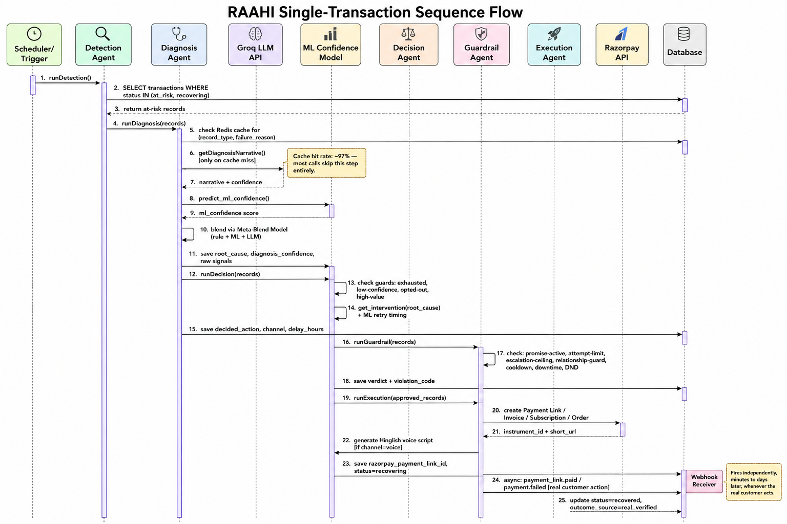
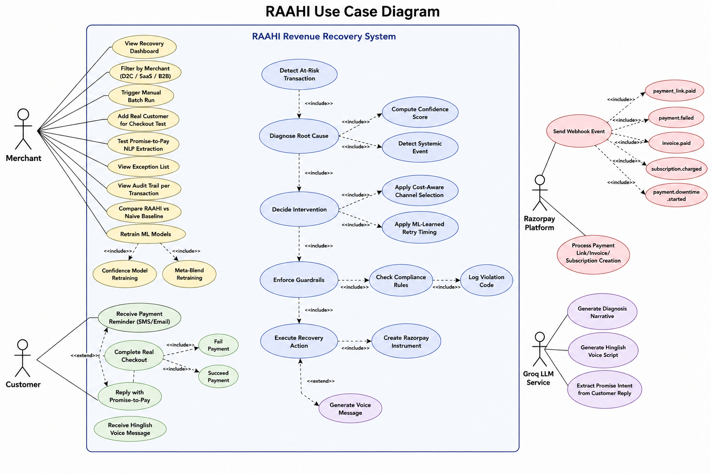
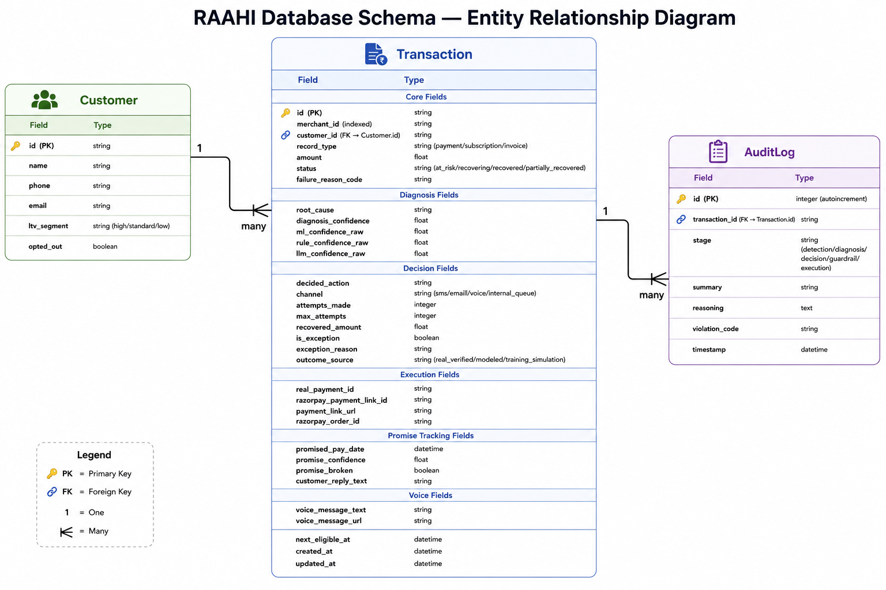
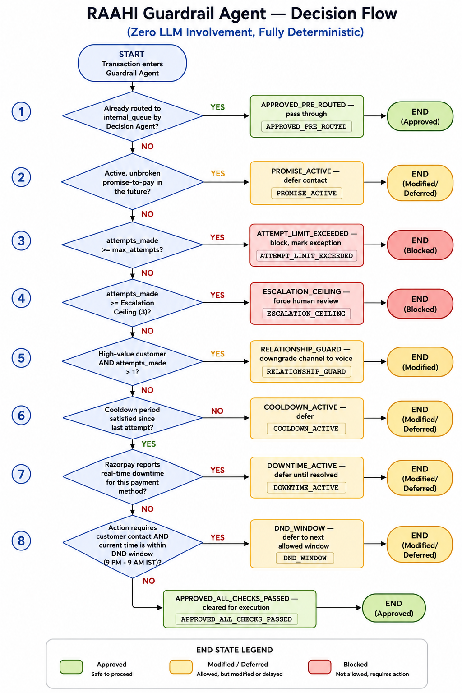
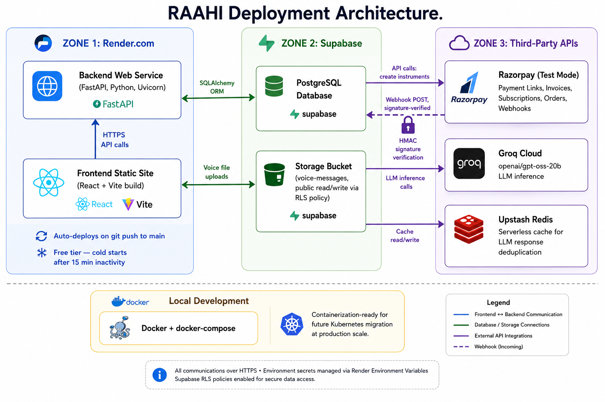

# RAAHI — Architecture Diagrams

---

## System Architecture

---

## Transaction Sequence Flow

---

## Use Case Diagram

---

## Database Schema (ER Diagram)

---

## Guardrail Agent Decision Flow

---

## Deployment Architecture

