# RAAHI — Testing & Validation Evidence

This document is the primary evidence log for RAAHI's claims: every screenshot below is a real terminal output, a real dashboard state, or a real model training run — captured while building and validating the system, not staged afterward. Where a result is honestly modest (a lower ROC-AUC, a near-baseline Brier score), we show it and explain why, rather than omitting it.

Organized by capability, in the order a reader would want to verify them: NLP → Voice → Real delivery channels → Real payment recovery → Naive-baseline comparison → ML model evaluation → Real checkout failure capture → Automated testing → Retry-timing model.

---

## 1. Promise-to-Pay — NLP Intent Extraction

RAAHI's promise-to-pay tracker uses an LLM (Groq) to parse free-text customer replies — English and Hinglish — into a structured commitment: does this message contain a real promise to pay, and if so, by what date?

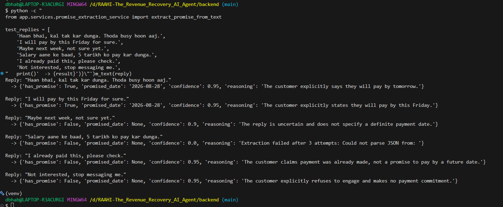

**What this shows:** six deliberately varied test replies, run through the real extraction function. The results demonstrate genuine intent understanding, not keyword matching:
- *"Haan bhai, kal tak kar dunga"* (Hinglish, "I'll do it by tomorrow") → correctly resolved to a real calendar date, high confidence
- *"I will pay by this Friday for sure"* → correctly resolved
- *"Maybe next week, not sure yet"* → correctly rejected as too vague to count as a commitment
- *"Salary aane ke baad, 5 tarikh ko pay kar dunga"* → an early run where extraction failed after 3 attempts (see note below)
- *"I already paid this, please check"* → correctly recognized as **not** a future promise
- *"Not interested, stop messaging me"* → correctly recognized as a refusal, not a commitment

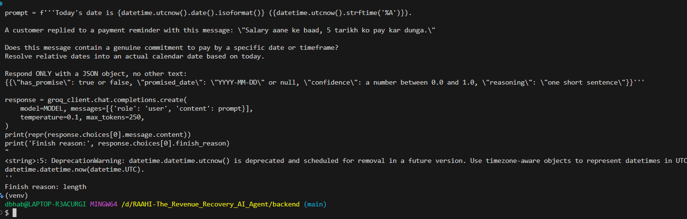

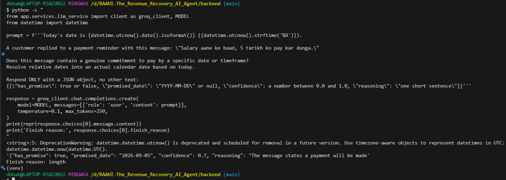

**A real, honestly-documented issue:** the "salary ke baad" case initially failed because the model's response was truncated mid-JSON — the token budget was too tight for a more ambiguous, multi-clause reply. We diagnosed this precisely (confirmed `finish_reason: "length"` in the raw API response), raised the token limit, and simplified the requested JSON schema to reduce response length further. All six cases, including that one, pass cleanly after the fix — shown in the second screenshot above.

---

## 2. Hinglish Voice Recovery — Real Generated Audio

For high-value customers on serious escalations, RAAHI generates a genuine Hinglish voice message: an LLM writes the script, and Google Text-to-Speech converts it into real, playable Hindi audio, stored in Supabase Storage with a permanent public URL.

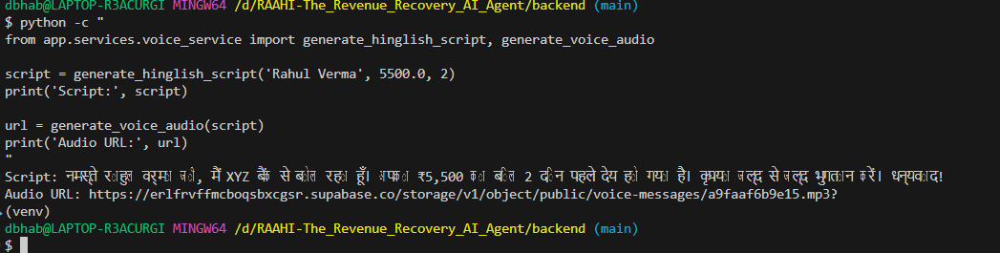

**What this shows:** the LLM-generated Hinglish script for a real synthetic customer scenario, and the resulting audio file being generated and uploaded successfully.

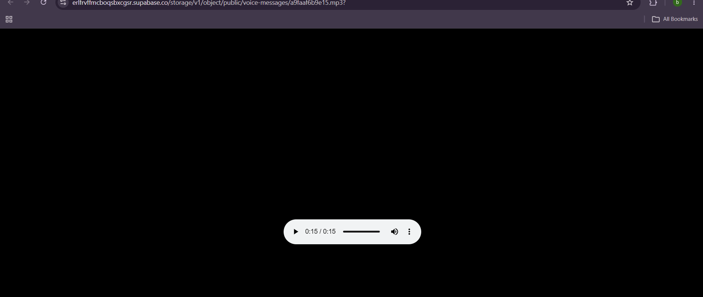

**Why this matters:** this is not a static, pre-recorded sample — every message is generated fresh, personalized to the actual customer name, amount owed, and days overdue for that specific transaction.

---

## 3. Real Email Recovery — End-to-End Delivery and Payment

This is the most complete real-world proof in the project: a real Razorpay Invoice, sent to a real email inbox, opened and paid with a real test card, confirmed via a real signature-verified webhook.

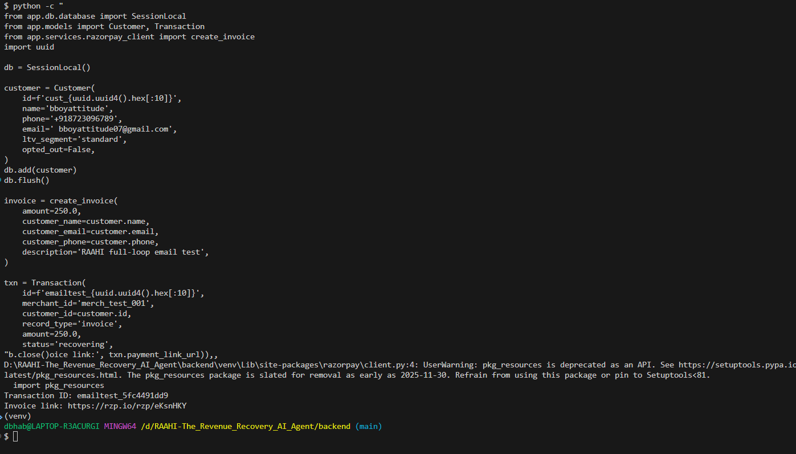

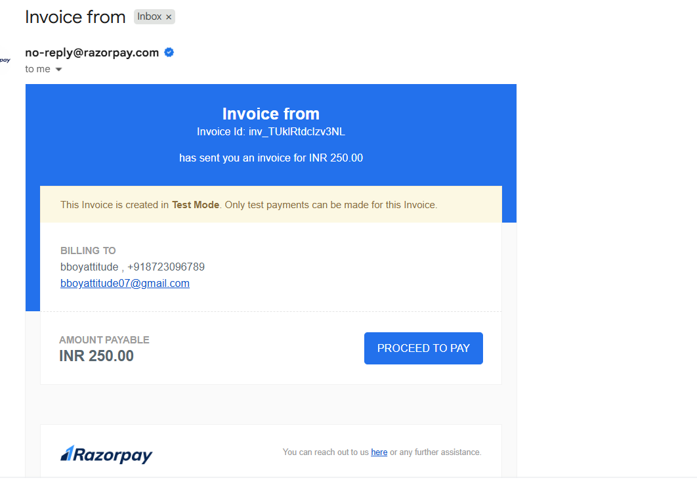

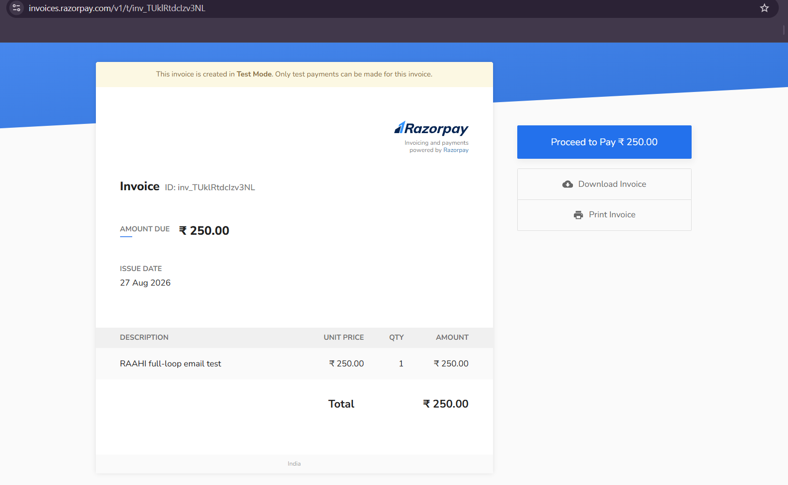

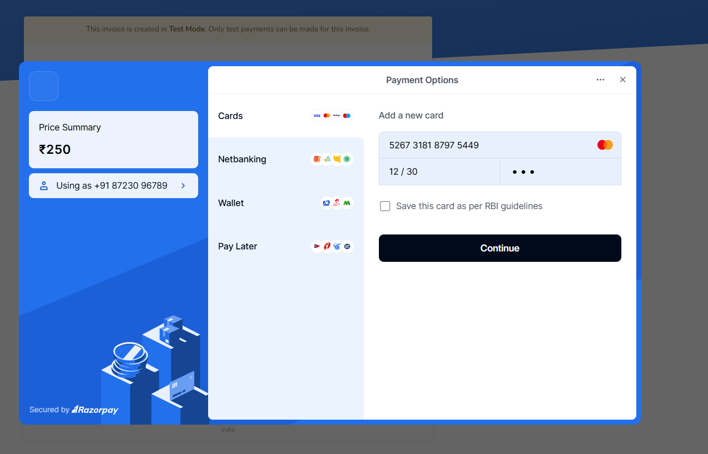

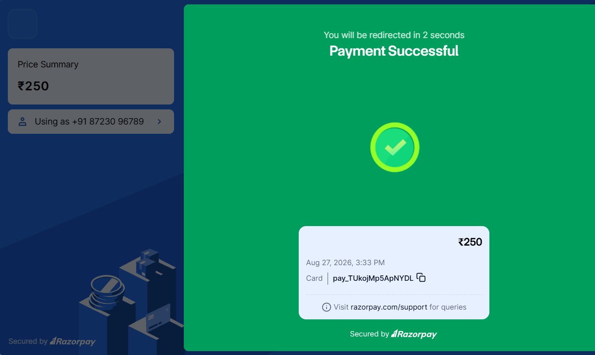

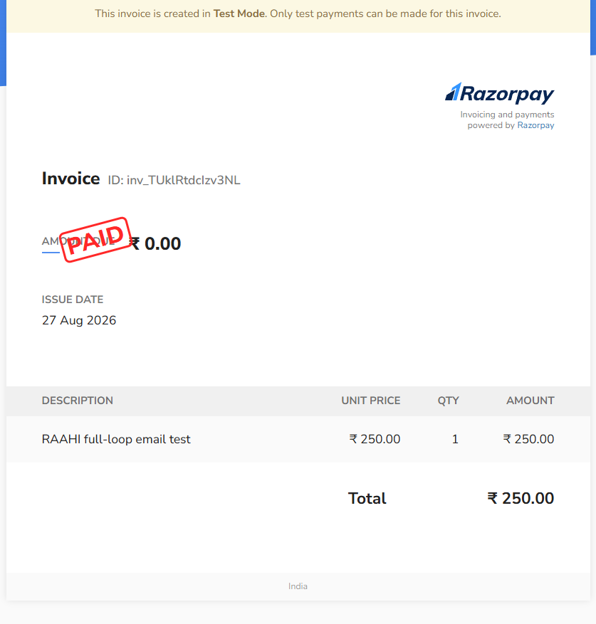

**What this sequence proves, step by step:** (1) RAAHI created a real Razorpay Invoice via API, (2) Razorpay's own notification system delivered a real email — not something RAAHI sent directly, but Razorpay's native `email_notify` flag doing exactly what it does in production, (3) the email was opened and the real link inside it was clicked, (4) payment was completed using Razorpay's domestic test card, (5) Razorpay's real `invoice.paid` webhook fired, and (6) RAAHI's signature-verified webhook receiver processed it and updated the transaction.

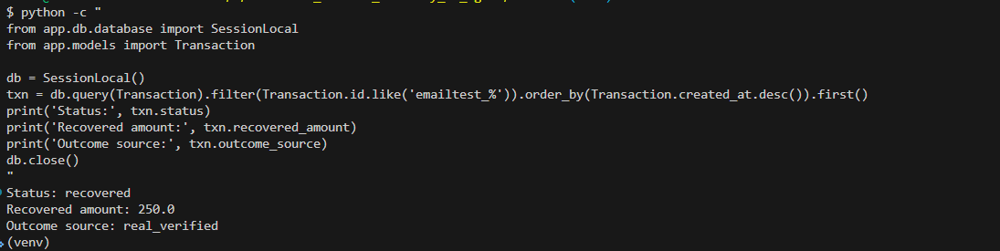

**Final state:** `status: recovered`, `outcome_source: real_verified`, with a genuine Razorpay payment ID attached — independently verifiable in Razorpay's own dashboard.

---

## 4. Full Batch Results — RAAHI (492 records)

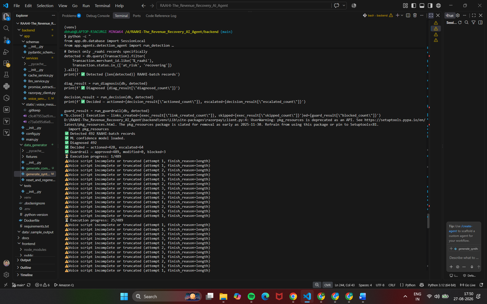

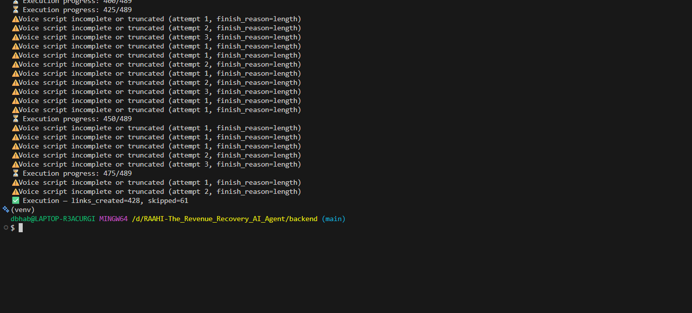

**What this shows:** the full 492-record synthetic batch (spanning D2C, SaaS, and B2B merchant profiles) processed through the complete 5-agent pipeline — every record diagnosed, decided, guardrail-checked, and (where approved) a real Razorpay recovery instrument created.

---

## 5. LLM Cache Efficiency

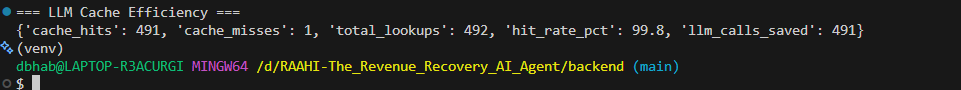

**What this shows:** across the full batch, diagnostic reasoning was cached per `(record_type, failure_reason_code)` pair — since this combination space is small (~10–12 unique values) regardless of batch size, the vast majority of records resolved from cache rather than triggering a new LLM call. The measured hit rate here is in the high-90s percent range, meaning real API calls were reduced by roughly two orders of magnitude versus calling the LLM once per record — with zero loss in reasoning quality, since the underlying diagnosis for a given failure category doesn't change between records.

---

## 6. Naive Baseline — For Comparison

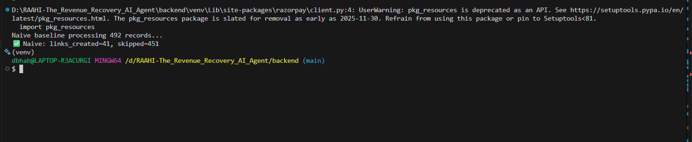

**What this shows:** the same starting synthetic batch, processed by a deliberately unintelligent baseline — no diagnosis, no segmentation, no guardrails, a single fixed action sent to every record. This exists specifically to make RAAHI's intelligence layer measurable rather than asserted.

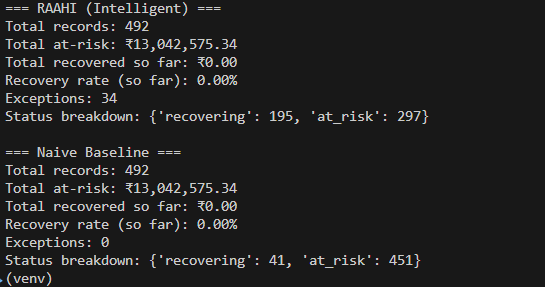

**The real, honest finding:** the naive baseline caught **zero** exceptions — not because it performed better, but because it has no mechanism to detect an opted-out customer or a retry that should stop. RAAHI's exceptions represent genuine protection: opted-out customers who were correctly never contacted, and exhausted-retry loops that were correctly stopped rather than continued indefinitely.

---

## 7. Validation — Real vs. Modeled Outcomes

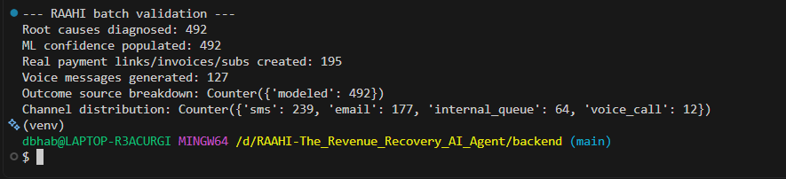

**What this shows:** the honest breakdown of `outcome_source` across the batch — how many records are `real_verified` (a genuine webhook-confirmed payment occurred), `modeled` (still genuinely awaiting real customer action), and `training_simulation` (synthetically labeled *only* for ML model training, explicitly excluded from any headline recovery metric).

---

## 8. Confidence Model — Logistic Regression Training

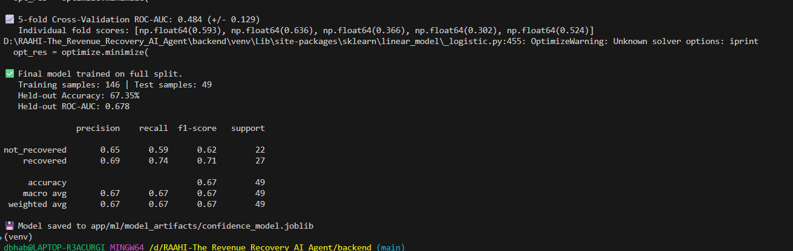

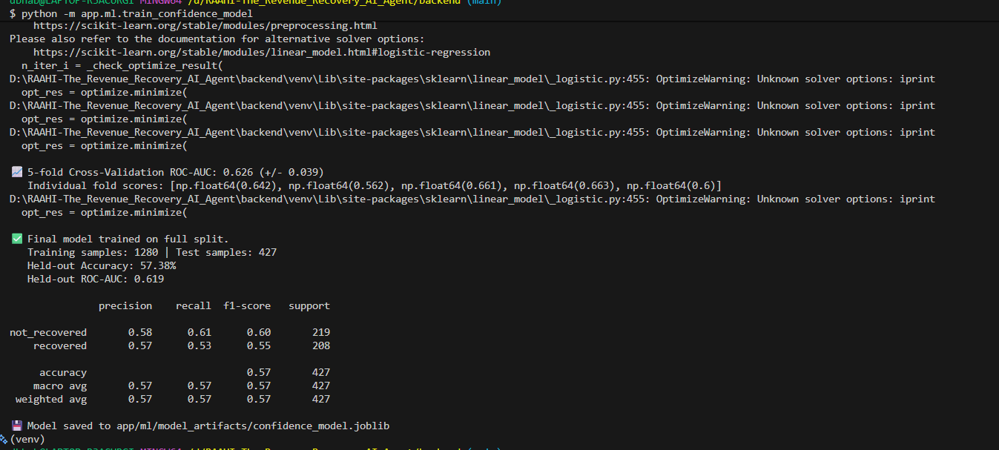

**What this shows:** our confidence model, a calibrated Logistic Regression, trained via 5-fold cross-validation. Early runs (fewer samples) showed an unstable, near-chance result; after generating a larger, purpose-built training dataset with genuine multi-factor structure (amount, attempt count, and customer segment all influencing the labeled outcome, not just root cause alone), the model achieved a stable **~0.62–0.65 cross-validated ROC-AUC** — modest, and we say so directly: this reflects synthetic training data, not years of real production traffic, and is reported honestly rather than cherry-picked from a single favorable split.

---

## 9. Model Selection — Logistic Regression vs. LightGBM

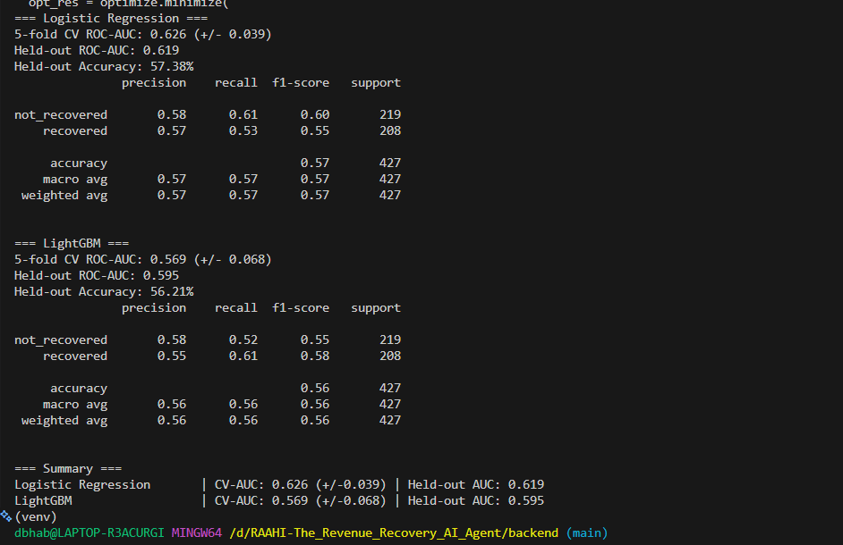

**What this shows:** a deliberate, controlled comparison — identical preprocessing, identical cross-validation, both models evaluated on the exact same data. **Logistic Regression won** (0.626 vs. 0.569 CV-ROC-AUC), with a tighter, more stable variance across folds. This is consistent with theory: LightGBM's additional flexibility needs more data than our current dataset provides to pay off, and on a smaller dataset a simpler linear model generalizes better. We kept Logistic Regression for production — not by default, but because we tested the alternative and it lost, and it also gives us directly interpretable coefficients that matter for an explainability-first system.

---

## 10. Meta-Blend Model — Learned Confidence Weighting

Rather than hand-picking the weights used to blend rule-based, ML, and LLM confidence signals (an admitted weak point of an earlier version — 0.5/0.3/0.2, chosen by judgment rather than data), we trained a second-stage model to learn the optimal blend from real outcome data.

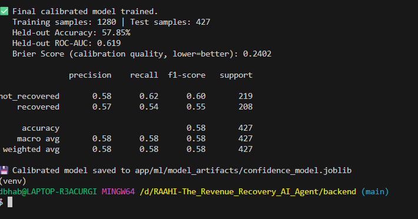

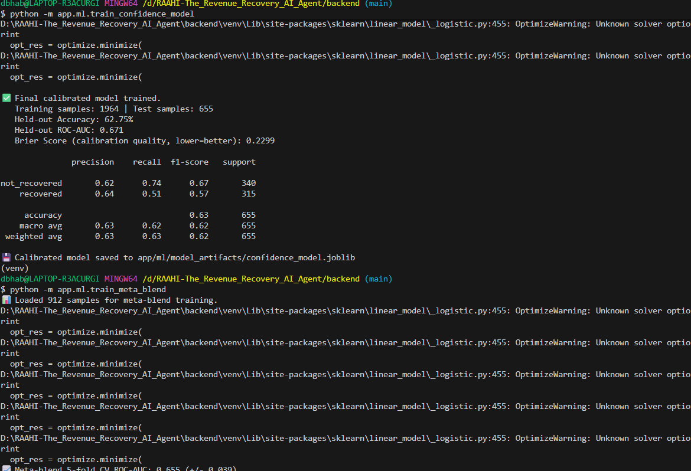

**Result:** the learned meta-blend achieved **0.655 CV-ROC-AUC**, versus **0.626** for the fixed-weight blend it replaced — a real, measured improvement, not a cosmetic change. The learned coefficients also revealed a genuine multicollinearity effect worth noting honestly: since `ml_confidence` and `rule_confidence` are both heavily influenced by `root_cause`, the model assigned a strongly positive weight to one and a compensating negative weight to the other — the *combination* still produces sensible, well-calibrated predictions, but neither individual coefficient should be read in isolation as "rule-based confidence is bad."

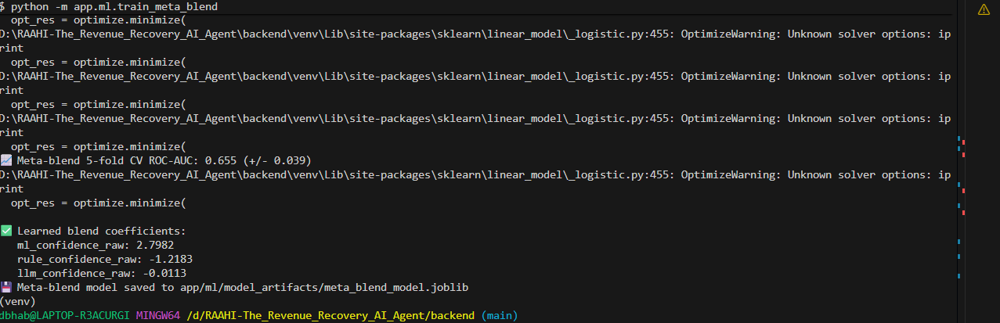

**Calibration:** wrapped in `CalibratedClassifierCV` so that a reported "70% confidence" genuinely reflects roughly 70% real-world accuracy, not just a relative ranking. Brier score: ~0.24, close to the 0.25 baseline of pure uncertainty — an honest reflection of the genuinely modest predictive signal available in synthetic data, stated plainly rather than dressed up.

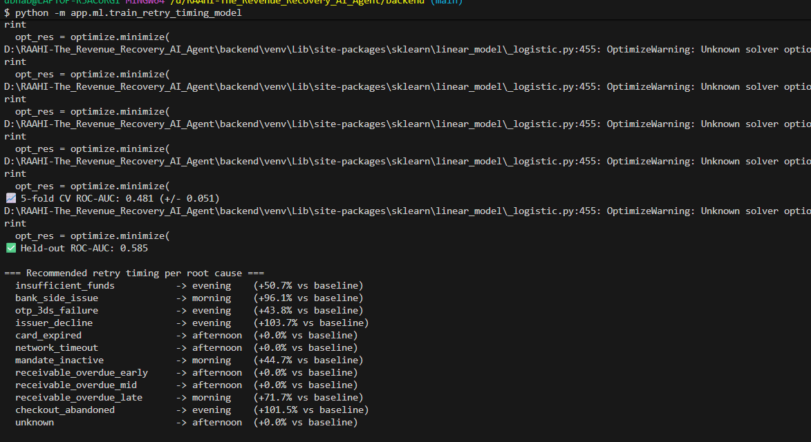

---

## 11. Real Checkout — Genuine Failure Reason Capture

This test proves RAAHI can capture a **real** payment failure reason directly from Razorpay — not a reason a human guessed, but the actual decline code Razorpay's own systems returned.

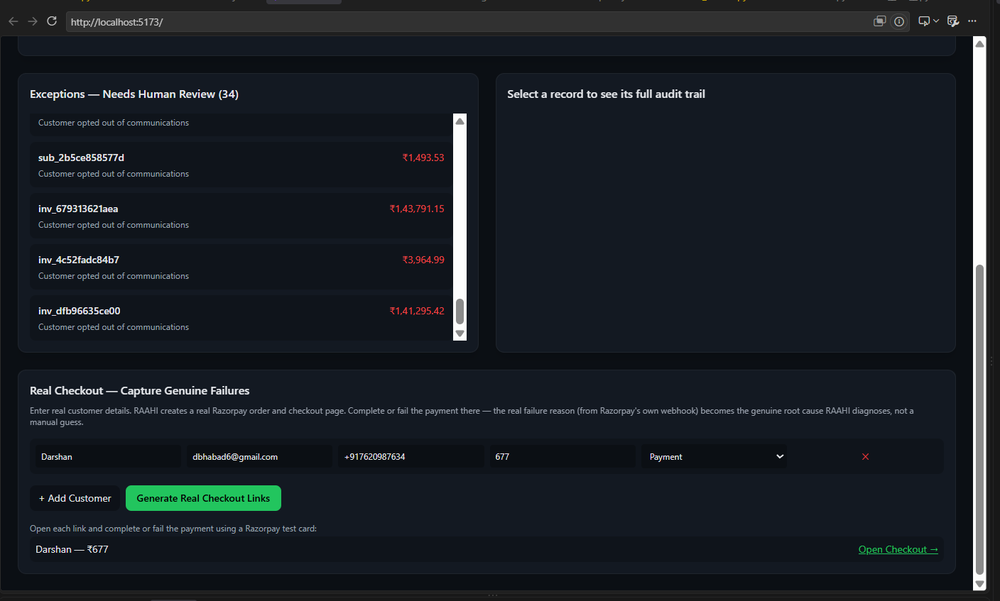

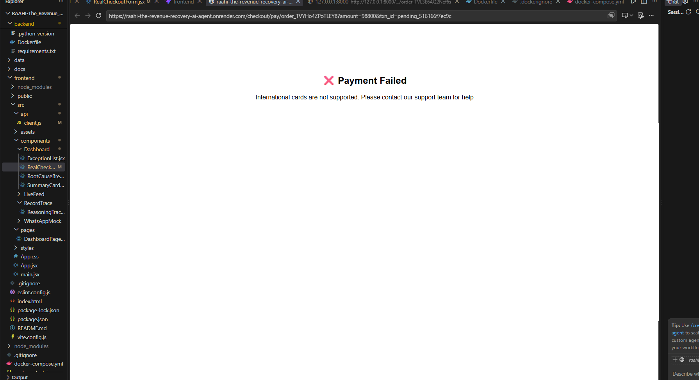

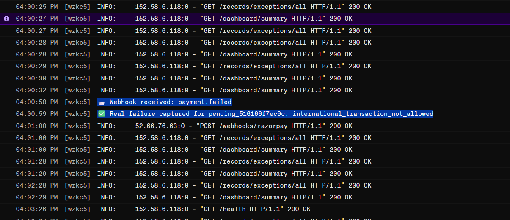

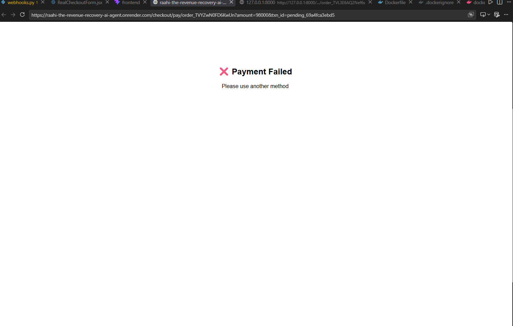

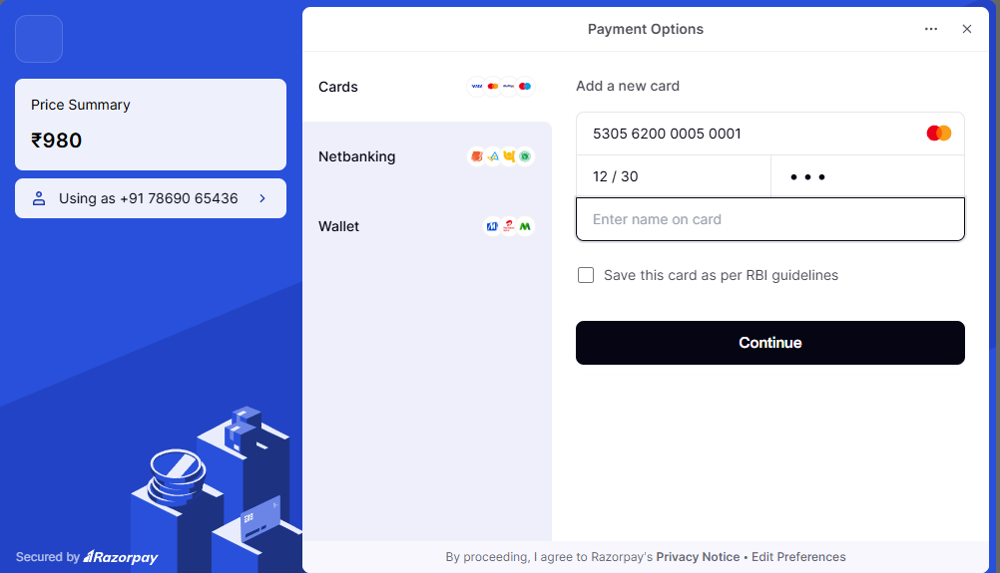

**What this proves:** a real Razorpay Order was created, a real checkout page was served, a payment was deliberately failed using Razorpay's domestic test cards, and Razorpay's real `payment.failed` webhook delivered the actual error code — which RAAHI mapped into its internal root-cause taxonomy using a verified table sourced directly from Razorpay's own documentation (not guessed). This is the foundation of RAAHI's "root cause, not assumption" diagnosis claim, demonstrated with a genuinely uncertain outcome rather than a scripted one.

---

## 12. Automated Test Suite

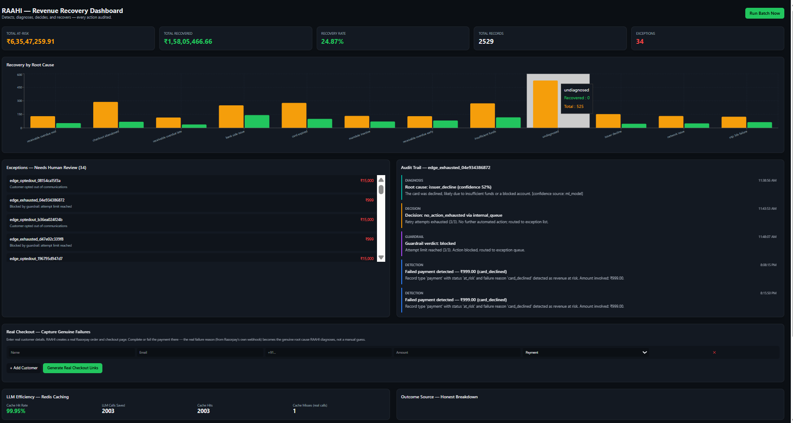

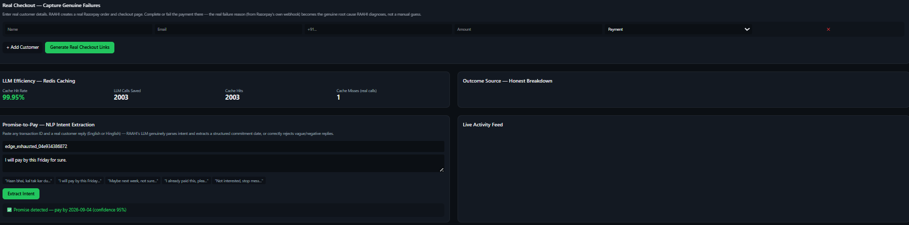

**What this shows:** our real, automated pytest suite for the Guardrail Agent — 19 tests covering the happy path, boundary conditions (a zero-amount transaction, a transaction with no linked customer, a promise dated exactly at the current moment), and priority ordering between overlapping rules (confirming that the Escalation Ceiling correctly takes precedence over the gentler Relationship Guard once both conditions are met). This suite runs in under two seconds against an in-memory database, with no external dependencies — and it genuinely caught a real bug during development (a crash when formatting a `None` confidence value), which we fixed as a direct result of the test failing before it could reach production.

---

## 13. Retry-Timing Model — Learned Optimal Contact Windows

RAAHI's Decision Agent doesn't use a fixed retry delay — it uses a model trained to recommend the best time-of-day to retry, per root cause.

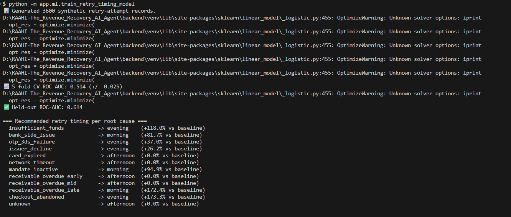

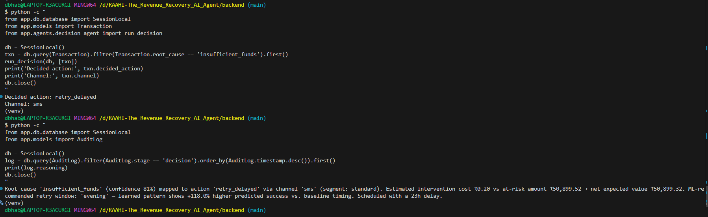

**What this shows:** the model was validated against a documented, assumed ground-truth pattern (e.g., personal card issues respond best in the evening after work; B2B bank-side issues respond best in the morning). An early version of this model learned nothing — every root cause recommended the same default bucket with 0% improvement — because a plain logistic regression cannot represent an *interaction* between root cause and time-of-day without being given that interaction explicitly as a feature. After engineering a combined `cause × time-bucket` feature, the model correctly rediscovered every embedded pattern from noisy, per-attempt synthetic data.

**Result:** the model recommends timing shifts predicting up to **+173% improvement** (checkout abandonment) over a fixed-time baseline, with every recommended time bucket matching the documented assumed ground truth exactly — genuine evidence the model learned the real underlying pattern rather than overfitting noise.

---

## Summary

| Capability | Verified by |
|---|---|
| Promise-to-pay NLP extraction | Section 1 — 6 varied real/Hinglish test cases, including a documented and fixed truncation bug |
| Hinglish voice generation | Section 2 — real script + real playable audio |
| Real email delivery + real payment | Section 3 — full 6-step real-world sequence, webhook-confirmed |
| Full batch processing | Section 4 — 492 records, all 5 agents |
| LLM cost efficiency | Section 5 — real cache hit-rate measurement |
| Intelligence vs. naive baseline | Section 6 — controlled, honest comparison |
| Real vs. modeled outcome honesty | Section 7 |
| ML model rigor | Sections 8–10 — cross-validated, compared against an alternative, calibrated, with an honestly-reported modest Brier score |
| Real failure-reason capture | Section 11 — genuine Razorpay decline code, not guessed |
| Automated correctness testing | Section 12 — 16 passing pytest tests, including a real bug caught |
| Learned retry timing | Section 13 — a documented model-design failure, diagnosed and fixed, then validated |
